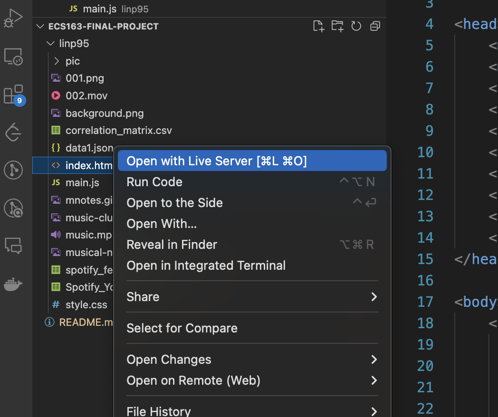

# ECS163-Final-Project
# Digital Beats: The Journey of Music in the Streaming Era
Welcome to the ECS163-Final-Project! This project is a data visualization endeavor designed to interpret and render charts from CSV data. Utilizing web technologies, this project reads specified .csv files and dynamically generates visual representations in a web browser.You can slide the mouse or use the up and down keys to read the story, or you can quickly jump to the location of interest through the menu in the lower right corner.
## Table of Contents
- Introduction
- Lay's Story
- Key Features
  - Danceability
  - Energy
  - Key
  - Loudness
  - Speechiness
  - Acousticness
  - Instrumentalness
  - Liveness
  - Valence
  - Tempo
  - Duration_ms
- Data Analysis
  - Radar Chart
  - Heatmap
  - Loudness & Energy
  - Valence & Danceability
  - Tempo & Acousticness
- In the End

## Installation

Before running the project, make sure you have the following prerequisites installed:

- Visual Studio Code
- A modern web browser (e.g., Chrome, Firefox, Safari)

To set up the project on your local machine, follow these steps:

1. Clone the repository to your local machine using the command:

```
git clone https://github.com/lnp95/ECS163-Final-Project.git
```

2. Navigate to the cloned directory:

```
cd ECS163-Final-Project
```

## Quick Start

To get the visualization up and running quickly, follow these steps:

1. Start Visual Studio Code
2. Install `live server` from extension store

3. Right click on the `index.html` and click Open with Live Server
4. Enjoy interacting with the data visualizations! You should see charts rendered based on the `spotify_feature_importances.csv` and `Spotify_Youtube.csv` files.

Feel free to explore the data and source code to get a better understanding of how the visualizations are implemented.

---
Thank you for checking out the Team6 ECS163-Final-Project!